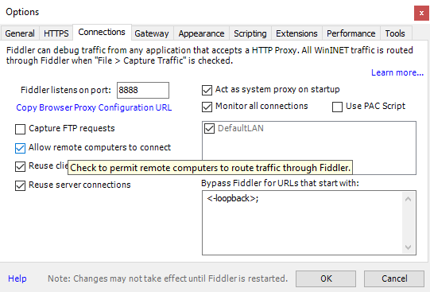
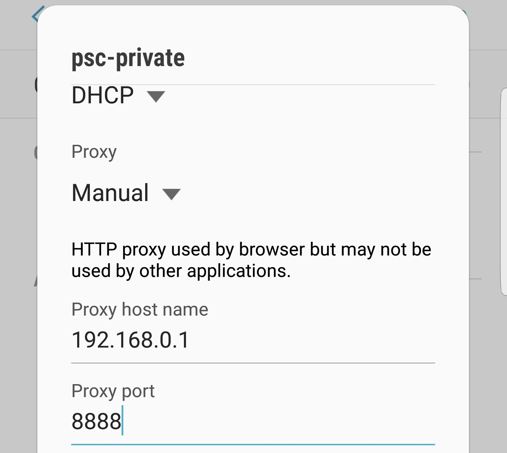

# GC2Toolkit
Used to be a GC2 Song Unlocker

# Build
Download the repo and run `build.bat`  

# How to use it?
1. Download GC2Toolkit.exe from [release page](https://github.com/rogeraabbccdd/GC2Toolkit/releases).
2. Download [Fiddler](https://www.telerik.com/fiddler).
3. Setting up Fiddler.
    1. Open Fiddler and select `Tools -> Options`
    2. Choose the `HTTPS` tab
    3. Check `Capture HTTPS CONNECTs`
    4. Uncheck `Decrypt HTTPS traffic`
    5. Choose the `Connections` tab
    6. Select the `Allow remote computers to connect` checkbox to enable the setting
    7. Restart Fiddler in order the changes to take effect  

  

4. Setting up mobile device
    1. Make sure your computer and mobile device are on the same WiFi network.
    2. Edit your current WiFi settings of mobile device.
    3. Choose `Manual` from the `Proxy` dropdown list
    4. Type your IP address in the Proxy host name field
    5. Type the Fiddler listening port (`8888` by default) in the `Proxy port` field
    6. Click `Save` to apply changes
  
  

5. Setting up AutoResponder
    1. Go to `AutoResponder` tab in Fiddler
    2. Click `Add Rule`
    3. Add the following text to your rule
      ```
      regex:http://gc2018.gczero.com/(.*)$
      http://YOUR_IP:1234/$1
      ```
    4. Click `Save`
    5. Check `Enable rules`
    6. Check `Unmatched requests passthrough` to prevent Fiddler block your other network requests.

  
  
6. Start GC2Toolkit.exe.
7. Satrt your game on mobile device.
