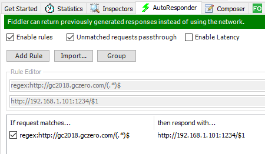

# GC2Toolkit
GC2 Song Unlocker

# Build
Download the repo and run `build.bat`  

# How to use it?
## Download tools
- Download GC2Toolkit.exe from [release page](https://github.com/SwigS-27/GC2Toolkit/releases/).
- Download [Fiddler](https://www.telerik.com/fiddler).

## Setting up GC2toolkit.
- It will unlock 600 songs and 150 avatars by default.
- Available commands
  - `help`: Display available commands.
  - `exit`: Exit this tool.
  - `reset`: Reset login timer to Day 1.
  - `set`: Set login timer to day you want.
  - `clear`: Clear screen.
  - `songcount`: Set song slot to be inserted (Default:600)
  - `avatercount`: Set avater slot to be inserted (Default:150)
  - `default`: Restore to default settings.

## Setting up Fiddler.
- If your device is Android, please follow instructions [here](https://www.telerik.com/blogs/how-to-capture-android-traffic-with-fiddler).
- If your device is iOS, please follow instructions [here](https://docs.telerik.com/fiddler/Configure-Fiddler/Tasks/ConfigureForiOS)

## Setting up AutoResponder
- Go to `AutoResponder` tab in Fiddler
- Click `Add Rule`
- Add the following text to your rule
  ```
  regex:(http|https)://gc2018.gczero.com/(.*)$
  http://YOUR_PC_IP:1234/$2
  ```
- Click `Save`
- Check `Enable rules`
- Check `Unmatched requests passthrough` to prevent Fiddler block your other network requests.

  
 
## Disable PC proxy
- Open `regedit.exe`
- Change `HKEY_CURRENT_USER\Software\Microsoft\Windows\CurrentVersion\Internet Settings\ProxyEnable` to 0

## Start your game
- Satrt your game on mobile device.
